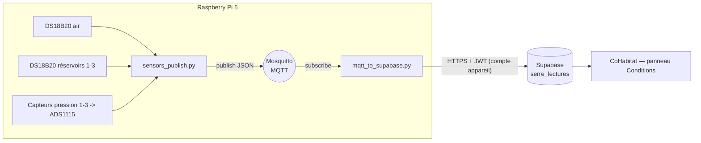

# Serre IoT — Acquisition des températures et niveaux (Raspberry Pi 5 + MQTT)

Acquisition automatique des **conditions de la serre** (température de l'air,
température et niveau de chaque réservoir) par un **Raspberry Pi 5**, publiées
en **MQTT**, puis insérées dans la table Supabase `serre_lectures`. Le panneau
« Conditions de la serre » de CoHabitat affiche la dernière lecture.

## Architecture



Deux processus indépendants (services systemd) :

1. **`sensors_publish.py`** — lit les capteurs toutes les *N* secondes et publie
   un message JSON combiné sur le topic MQTT `serre/lectures`.
2. **`mqtt_to_supabase.py`** — s'abonne à ce topic et insère chaque lecture dans
   `serre_lectures` via l'API REST Supabase, authentifié par un **compte
   appareil** (les insertions respectent la RLS : `created_by = auth.uid()`).

Découpler les deux via MQTT permet d'ajouter facilement d'autres abonnés
(tableau de bord local, alertes, domotique) sans toucher à l'acquisition.

## Matériel suggéré (adaptable)

| Rôle | Capteur | Interface |
|------|---------|-----------|
| Température de l'air | DS18B20 (ou SHT31 I²C) | 1-Wire (GPIO4) |
| Température réservoirs 1-3 | 3× DS18B20 étanches | 1-Wire (même bus) |
| Niveau réservoirs 1-3 | 3× capteurs de **pression** submersibles | ADC I²C **ADS1115** |
| Broker | Mosquitto sur le Pi | — |

- Les **DS18B20** partagent un seul bus 1-Wire (une résistance de tirage 4,7 kΩ
  entre DATA et 3V3). Chaque sonde a un identifiant ROM unique (`28-xxxxxxxx`).
- **Niveau par pression** : la pression au fond est proportionnelle à la hauteur
  d'eau — insensible aux plantes, mousses ou obstacles (contrairement à
  l'ultrason). Le Raspberry Pi n'ayant pas d'entrée analogique, on passe par un
  **ADS1115** (ADC 16 bits I²C, jusqu'à 4 voies → les 3 réservoirs tiennent sur
  un seul module).
  - **Capteur recommandé pour cuves IBC 1000 L (~1,15 m) : NXP MPX5050DP**
    (0–50 kPa ≈ 5 m → aucune saturation, alimenté en 5 V). Sa sortie reste basse
    (~0,2–1,3 V pour 0–1,15 m), donc l'**ADS1115 peut être alimenté en 3,3 V**
    (n'importe quelle carte, sans souci de résistances de tirage). Résolution
    ~0,1 mm grâce à l'ADC 16 bits. *(Pour un réservoir ≤ 1 m, le MPX5010DP
    0–10 kPa, sortie 0,2–4,7 V, donne un peu plus de dynamique.)*
    - Capteur **sec** à 2 ports : **P1** (côté encoche) reçoit le **tube/bulleur**
      vers la cuve ; **P2** reste **ouvert à l'air**. Ne jamais immerger le
      capteur ni sceller P2.
    - Éviter le **MPX10DP** : sortie brute ~35 mV non compensée, nécessite un
      amplificateur d'instrumentation.
    - 💡 **Calibration facile** : l'IBC a une **graduation en litres** sur le
      côté. Note la tension affichée à un repère bas (cuve ~vide) → `V_EMPTY`,
      et à un repère haut (cuve ~pleine) → `V_FULL`. La pression étant linéaire,
      2 points suffisent, et tu peux vérifier visuellement au passage.
  - Alternative **sonde submersible 0,5–4,5 V** : se dépose directement au fond
    (étanche), sans tube ni colonne d'air.
  - Capteur **4–20 mA** : ajoutez une résistance shunt de précision (ex. 150 Ω →
    0,6–3,3 V) et lisez la tension à ses bornes.

## Câblage (par défaut, modifiable dans la config)

- 1-Wire DS18B20 : DATA → **GPIO4**, VCC → 3V3, GND → GND, pull-up 4,7 kΩ.
- ADS1115 : **SDA → GPIO2**, **SCL → GPIO3**, GND → GND, ADDR → GND (`0x48`).
  **Alimentez l'ADS1115 en 5 V** pour pouvoir lire jusqu'à ~4,7 V. ⚠️ Utilisez
  une carte **sans résistances de tirage I²C intégrées** (ex. Adafruit) : sinon
  elles tireraient le bus à 5 V vers le Pi (3,3 V). Avec une carte à pull-ups
  intégrés, alimentez-la en 3,3 V et ajoutez un **diviseur 2:1** sur chaque
  sortie capteur (et divisez alors `V_EMPTY`/`V_FULL` par 2).
- MPX5010DP : **VS → 5 V**, **GND → GND**, **Vout → A0** (réservoir 1) ; capteurs
  2 et 3 → **A1** / **A2**. Gain ADS1115 **2/3** pour ne pas écrêter 0,2–4,7 V.
- Côté pneumatique : **P1 (encoche) → tube vers le réservoir**, **P2 → ouvert à l'air**.

### Montage du niveau — méthode bulleur (recommandée)

Le MPX5010DP reste **au sec** ; seul un **boyau d'aquarium** descend au fond du
réservoir. Une **petite pompe à air d'aquarium** envoie un filet d'air continu
dans le boyau : la contre-pression pour buller au fond = hauteur d'eau.

```
  pompe à air ─┬─► P1 (MPX5010DP)   P2 → air ambiant
               │
             boyau
   ~~~~~~~~~~~~│~~~~~~~~~ surface
              │  eau (≤ 1 m)
        (bout ouvert au fond, bulles)
```

- **Aucune dérive**, capteur jamais mouillé. En sablonponie, tu peux te brancher
  sur une pompe à air existante (avec un té pour dériver un filet d'air).
- Variante **sans pompe (air piégé)** : boyau bouché en haut sur P1, ouvert en
  bas. Fonctionne, mais l'air se dissout lentement → **recalibrer** de temps en
  temps.
- **Calibration** : réservoir vide → note la tension = `V_EMPTY` (~0,2 V) ;
  remplis à 1 m → `V_FULL` (~4,6 V). Le script `sensors_publish.py` affiche les
  tensions/niveaux à chaque cycle pour t'aider.

## Installation

### 1. Activer 1-Wire + I²C et installer les dépendances

```bash
sudo raspi-config nonint do_onewire 0        # active 1-Wire (DS18B20)
sudo raspi-config nonint do_i2c 0            # active I2C (ADS1115)
sudo apt update
sudo apt install -y mosquitto mosquitto-clients python3-venv i2c-tools
sudo systemctl enable --now mosquitto
# vérifier l'ADS1115 : i2cdetect -y 1  → doit montrer 48

cd serre-iot
python3 -m venv .venv
. .venv/bin/activate
pip install -r requirements.txt
```

### 2. Créer le compte « appareil » Supabase

Dans Supabase → **Authentication → Users → Add user**, créez par exemple
`serre-pi@device.local` avec un mot de passe fort. Ce compte n'a pas besoin
d'être admin : la policy `serre_lectures_insert` autorise tout utilisateur
authentifié à insérer une ligne dont `created_by = auth.uid()`.

> Assurez-vous d'avoir un profil pour ce compte (le trigger `handle_new_user`
> en crée un automatiquement à l'inscription). Sinon, insérez une ligne dans
> `profiles` avec son `id`.

### 3. Configurer

```bash
cp config.example.env config.env
nano config.env        # URL/clé Supabase, identifiants appareil, GPIO, calibrations
chmod 600 config.env   # le fichier contient un mot de passe
```

Renseignez surtout :
- `SUPABASE_URL`, `SUPABASE_ANON_KEY` (les mêmes que le site).
- `DEVICE_EMAIL`, `DEVICE_PASSWORD` (le compte créé à l'étape 2).
- Les ROM des DS18B20 (`W1_AIR`, `W1_RESERVOIR1..3`) — listez-les avec
  `ls /sys/bus/w1/devices/` (dossiers `28-...`).
- Les voies ADS1115 (`RES1_ADC_CHAN`…) et la **calibration** des niveaux :
  `RESn_V_EMPTY` (tension réservoir vide) et `RESn_V_FULL` (réservoir plein).
  Mesurez-les in situ (réservoir vide puis plein) pour un % juste.

### 4. Tester manuellement

```bash
. .venv/bin/activate
python sensors_publish.py            # publie une fois puis en boucle ; Ctrl+C pour arrêter
# dans un autre terminal :
mosquitto_sub -t 'serre/lectures'    # voir les messages
python mqtt_to_supabase.py           # insère dans Supabase
```

### 5. Lancer comme services

```bash
sudo cp systemd/serre-sensors.service systemd/serre-bridge.service /etc/systemd/system/
# ajustez WorkingDirectory / User / chemins .venv dans les deux fichiers
sudo systemctl daemon-reload
sudo systemctl enable --now serre-sensors serre-bridge
journalctl -u serre-sensors -f       # logs
```

## Format du message MQTT

Topic `serre/lectures`, charge JSON (les champs absents deviennent `null`) :

```json
{
  "temp_air": 24.6,
  "reservoir1_temp": 18.4, "reservoir1_pct": 82,
  "reservoir2_temp": 19.1, "reservoir2_pct": 67,
  "reservoir3_temp": 17.9, "reservoir3_pct": 90,
  "ts": "2026-08-14T13:05:00Z"
}
```

Le pont insère une ligne `serre_lectures` par message (colonnes `temp_air`,
`reservoirN_temp`, `reservoirN_pct`, `horodatage`). Il ignore les messages sans
aucune mesure valide.

## Fréquence et volumétrie (deux cadences distinctes)

Pour avoir des mesures fraîches **sans** gonfler la base, l'acquisition et
l'écriture sont découplées :

- **`PUBLISH_INTERVAL`** (défaut **5 s**) : cadence de lecture et de publication
  MQTT. Peu coûteux, local. C'est ce que voient les abonnés MQTT en direct.
- **Écriture Supabase** : le pont n'insère une ligne `serre_lectures` que si une
  valeur a **changé** au-delà d'un seuil (`TEMP_DEADBAND` 0,2 °C,
  `LEVEL_DEADBAND` 1 %), ou au plus tard après **`DB_HEARTBEAT`** (défaut 300 s).

Ainsi, à 5 s de cadence MQTT, la base ne reçoit typiquement que quelques
dizaines de lignes/jour (au lieu de ~17 000 si on écrivait chaque message).
Pour tout enregistrer au rythme MQTT : `DB_HEARTBEAT=5` et les deux seuils à `0`.

Le panneau CoHabitat n'affiche que la **dernière** lecture. Pour un affichage
qui bouge en direct, voir « Prochaine étape » (Supabase Realtime).

## Sécurité

- Le pont utilise un **compte appareil** (JWT via mot de passe), pas la clé
  `service_role`. Gardez `config.env` en `chmod 600`.
- Alternative plus stricte : une **Edge Function** Supabase `ingest-lecture`
  qui reçoit un secret d'appareil et insère la ligne côté serveur — le Pi ne
  détient alors qu'un secret étroit. Voir `mqtt_to_supabase.py` (section notes).
- Restreignez Mosquitto au réseau local (ou activez `password_file`/TLS) si le
  broker est exposé.

## Prochaine étape possible (option)

Activer **Supabase Realtime** sur `serre_lectures` et abonner le panneau
« Conditions » pour un rafraîchissement automatique sans recharger la page.
